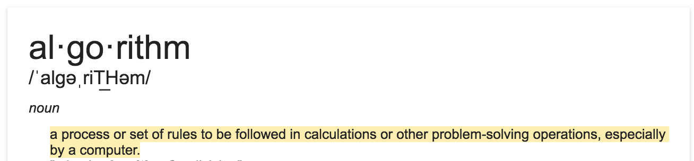

The word 'algorithm' is a latinization of al-Khwārizmī[1](#myfootnote1).

An algorithm is a set of a step-by-step instructions that a computer program follows in order to complete a task.

<a name="myfootnote1">1</a>: Muḥammad ibn Mūsā al-Khwārizmī(d. 850), a Muslim mathematician, astronomer, and geographer.